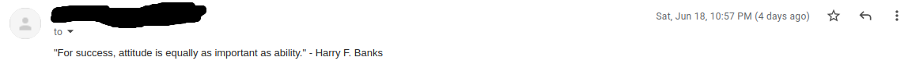

# Motivation-Quote-Sender

### [twitter](https://twitter.com/achte_te)

## Description

An automated Motivation Quote Sender that sends motivation quotes automatically using Python with the help of SMTP. This code is hosted on [pythonanywhere](https://www.pythonanywhere.com). The quotes are sent weekly on Mondays at 7:00 a.m.

## Requirements

[Python](https://www.python.org/)

```sh
$ python3 --version
Python 3.9.12
```

[os](https://docs.python.org/3/library/os.html)

[random](https://docs.python.org/3/library/random.html)

[smtplib](https://docs.python.org/3/library/smtplib.html)

[datetime](https://docs.python.org/3/library/datetime.html)


## Install

```sh
$ git clone git@github.com:achte-2022/Motivation-Quote-Sender.git
```

## Setting Up Environment Variables 

### Environment Variables are DUMMY values

```sh
$ cd Automated-Birthday-Wisher
$ export TO_MAIL=random@gmail.com
$ export FROM_MAIL=random@yahoo.com;
$ export PASSWORD=password123;
$ export SMTP_SERVER=smtp.mail.yahoo.com;
```

## Run

```sh
$ cd Automated-Birthday-Wisher
$ python3 main.py
```

## Email

